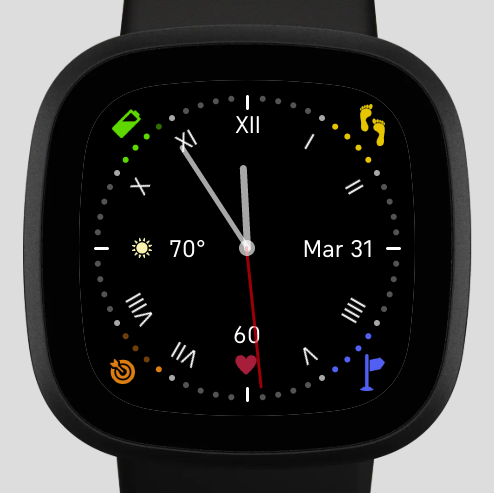
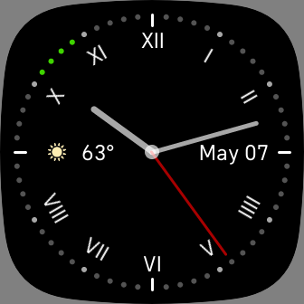
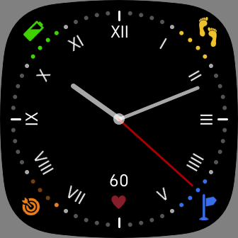

# Fitbit-ClassicClock
## Analog clock with sensor info for Fitbit Versa 3
This is an analog clock with selected sensor information, plus date and weather. Included sensors are: 
+ Battery
+ Heart Rate
+ Steps
+ Distance
+ Active Zone Minutes

Battery, Steps, Distance and Active Zone sensors have a status display integrated into the clock face, with indicators set for >20%, >40%, >60% and >80%. Month and date are displayed, along with current weather conditions and temperature, and current heart rate.

Settings:
+ Temperature Unit (C/F)
+ Hide Date
+ Hide Weather
+ Hide Heart Rate
+ Hide Goals*
 
 (*) When goals are hidden, their status display is also inactive, but Battery status stays active.

### Hidden Heart Rate and Goals / Hidden Date and Weather:

Code is present to support Always On Displays, but the necessary permissions are not currently enabled.

Please feel free to submit a pull request with any improvements or bug fixes.